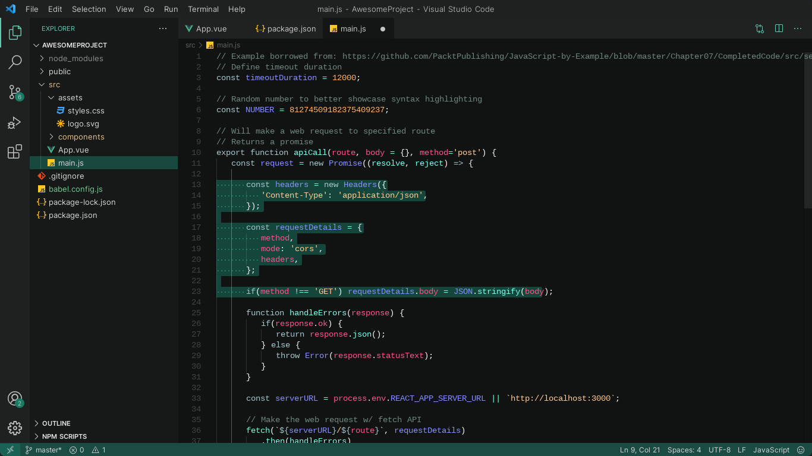
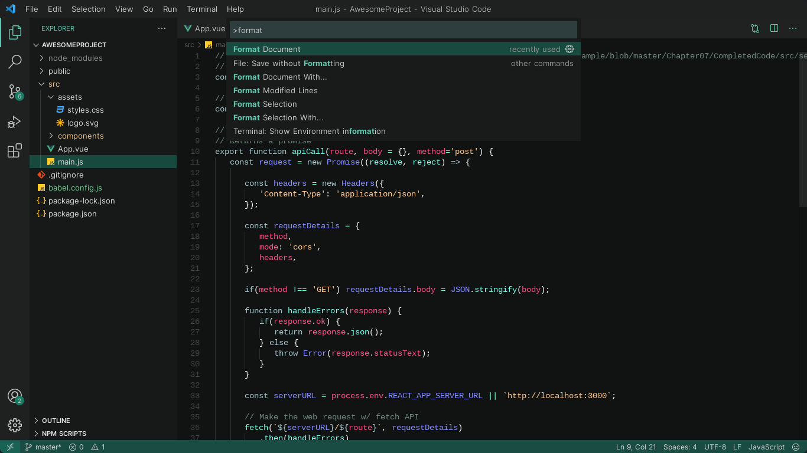
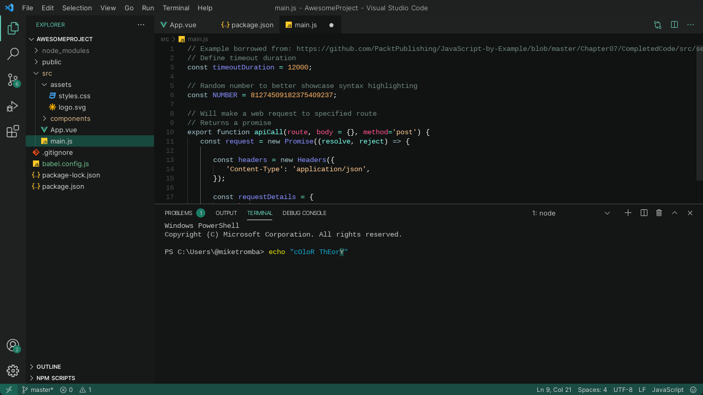

# Sea Dark

A beautiful contrast dark theme that helps you focus on your code, inspired by Monokai with a sea green twist. This theme improves readability.

## Previews







## How to Install

In order to install this theme manually, please follow the following steps:

- Download the latest release [here](https://github.com/jeanravenclaw/sea-dark/releases/)
- Go to VS Code and run the following code on the terminal:
	```terminal
	code --install-extension {path}
	```
- Open Settings and select Color Theme
- Select Sea Dark as your theme, under Dark Themes